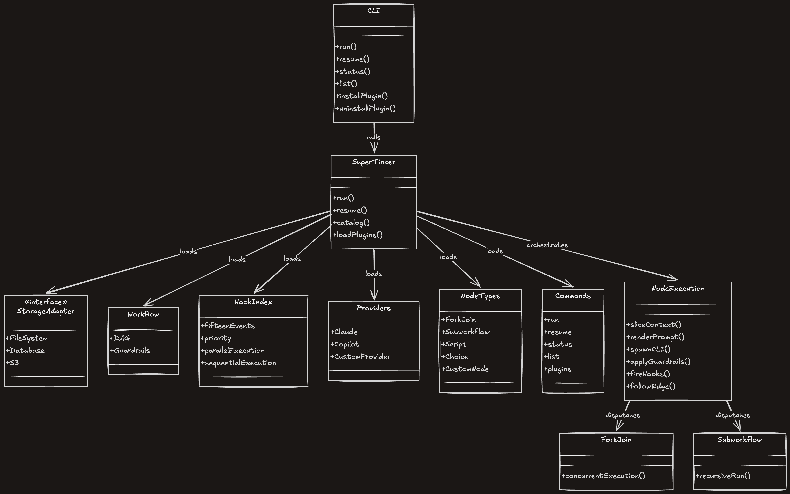

<p align="center">
  
</p>

<h1 align="center">supertinker</h1>

<p align="center">
  <strong>a thin, composable multi-agent orchestrator — one file, zero dependencies, infinitely extensible</strong>
</p>

<p align="center">
  <a href="https://github.com/AndurilCode/supertinker/stargazers"></a>
  <a href="https://github.com/AndurilCode/supertinker/commits/main"></a>
  <a href="LICENSE"></a>
  
</p>

<p align="center">
  <a href="#features">Features</a> •
  <a href="#install">Install</a> •
  <a href="#usage">Usage</a> •
  <a href="#plugins">Plugins</a> •
  <a href="#writing-workflows">Workflows</a> •
  <a href="#architecture">Architecture</a>
</p>

---

Define **directed graphs** of AI agent calls — Claude Code, GitHub Copilot, or any custom provider. Each node invokes an agent, captures output into shared context, and follows an edge determined by the agent's own choice. The engine is a single TypeScript file with zero npm dependencies. Everything else — providers, hooks, workflows, storage — is a plugin you drop into a folder.

Runs anywhere Node.js runs: laptop, CI runner, dev container. No server, no database, no compile step.

## Features

- **Graph-based workflows** — DAGs with fan-out, fan-in, review loops, label-based branching
- **Multi-agent** — `claude` CLI, `copilot` CLI, or drop-in custom providers
- **Plugin system** — six extension points (hook, provider, workflow, storage, **node**, **command**) installable via CLI
- **Pluggable node types** — ship custom node types (`script`, `choice`, …) alongside the built-ins
- **Pluggable CLI commands** — extend the `cli` surface with your own subcommands via the `CommandPlugin` contract
- **Meta-workflow** — an architect agent designs workflows at runtime, then executes them
- **Subworkflows** — embed one workflow inside another as a first-class node type
- **Fork / join** — fan out to N branches concurrently, synchronize at a join node
- **Git worktree isolation** — fork branches run in separate git worktrees for safe parallel edits
- **Pause & resume** — any node can pause for human input; resume with a choice label
- **Guardrails** — pre/post checks (JS expressions or TypeScript functions); retry once, then pause
- **Template validation** — pre-flight check that `[nodeId]` references in instructions point to real nodes
- **Context slicing** — nodes declare which context keys the agent sees, keeping token budgets predictable
- **Output memoization** — opt-in `context-cache` hook skips re-execution when a node's inputs haven't changed
- **Structured logging** — human-readable `orchestrator.log` + machine-readable NDJSON event stream
- **Tmux integration** — auto-spawns panes to tail orchestrator and per-agent logs
- **Zero dependencies** — only Node.js built-ins: `fs`, `child_process`, `path`, `os`

## Install

### As a skill (recommended)

Install the supertinker skill into your AI agent with [skills](https://skills.sh):

```bash
npx skills add AndurilCode/supertinker
```

Once installed, your agent can invoke supertinker through the `/supertinker` command or naturally when you ask it to orchestrate multi-agent workflows.

### Standalone

```bash
npx github:AndurilCode/supertinker run --prompt "Build a REST API with authentication"
```

Or clone for development:

```bash
git clone https://github.com/AndurilCode/supertinker.git
cd supertinker
tsx cli.ts run --prompt "Build a REST API with authentication"
```

### Prerequisites

- **Node.js** v18+
- A TypeScript runner — **bun** (fastest), **tsx** (`npm i -g tsx`), or **Node.js ≥ 22.6** (built-in `--experimental-strip-types`)
- At least one agent CLI in `$PATH`: [`claude`](https://docs.anthropic.com/en/docs/claude-code) (required), `copilot` (optional plugin)

## Usage

### Run a workflow

```bash
# Meta-workflow — an architect designs the right workflow for your task
npx github:AndurilCode/supertinker run --prompt "Migrate the schema to add soft deletes"

# Named workflow
npx github:AndurilCode/supertinker run --workflow plan-develop-review --prompt "Add user auth"

# Workflow file by path
npx github:AndurilCode/supertinker run --workflow ./my-workflow.ts --prompt "Refactor the data layer"
```

### Resume a paused run

```bash
npx github:AndurilCode/supertinker resume \
  --run meta-generate-and-run-<timestamp> \
  --choice approved \
  --workflow meta
```

### Other commands

```bash
npx github:AndurilCode/supertinker status --run <runId>     # check run status
npx github:AndurilCode/supertinker list                     # list available workflows
npx github:AndurilCode/supertinker list --hooks              # list loaded hooks + events
```

## Plugins

Plugins are the primary extension mechanism. Each lives in `plugins/<type>/<name>/` with a `manifest.json`.

### Available plugins

| Name | Type | Description |
|------|------|-------------|
| **logger** | hook | Structured logging to `orchestrator.log` and stdout |
| **events** | hook | NDJSON event stream to `events.ndjson` for machine-readable audit |
| **fork-worktree** | hook | Git worktree isolation for parallel fork branches |
| **tmux-panes** | hook | Opens tmux panes for orchestrator and per-agent log tailing |
| **validate-templates** | hook | Aborts run if instructions reference undefined `[nodeId]` variables |
| **context-cache** | hook | Content-addressable memoization — skips re-execution when cached output exists |
| **metrics** | hook | Per-agent and per-run token usage, cost, and duration from provider logs |
| **notify** | hook | macOS system notifications for agent completion, pauses, and workflow end |
| **sanitize-json** | hook | Strips markdown code fences from agent output that should be raw JSON |
| **user-pause** | hook | Pause on user request — checks for a `pause-requested` file on `PreAgent` |
| **copilot** | provider | GitHub Copilot CLI provider with sentinel-based choice parsing |
| **meta** | workflow | Architect agent designs a workflow, then the orchestrator executes it |
| **code-review** | workflow | Multi-lens code review: quality, security, and project rules — inline comments + summary |
| **script** | node | Runs a shell command; stdout becomes the node's output |
| **choice** | node | Runs a shell command; the first line of stdout selects the next branch |
| **scheduler** | command | Schedule supertinker workflows via launchd (macOS) |
| **custom** | storage | Project-local workflow persistence to `.supertinker/workflows/` |

### Manage plugins

```bash
npx github:AndurilCode/supertinker plugins list                     # all available
npx github:AndurilCode/supertinker plugins list --installed          # installed only
npx github:AndurilCode/supertinker plugins install                   # interactive picker
npx github:AndurilCode/supertinker plugins install logger events     # install by name
npx github:AndurilCode/supertinker plugins install --global          # install to ~/.supertinker/
npx github:AndurilCode/supertinker plugins uninstall copilot --local
npx github:AndurilCode/supertinker plugins update                    # sync to latest
```

### Plugin search order

Plugins are discovered in three locations, **project-local first**:

| Priority | Location | Scope |
|----------|----------|-------|
| 1 | `.supertinker/` | Per-project (highest) |
| 2 | `~/.supertinker/` | Per-user |
| 3 | `<install-dir>/` | Built-in (lowest) |

Providers and workflows **override** by name (first match wins). Hooks **merge** (all hooks from all locations run). Storage adapters merge (custom methods override defaults).

<details>
<summary><strong>Writing a plugin</strong></summary>

Each plugin is a directory under `plugins/<type>/<name>/` with a `manifest.json` (declaring `name`, `type`, `description`, `files`, `version`) plus the implementation files it references. Users install it with `plugins install <name>`.

For scaffolding, schemas, and worked examples, invoke the **`supertinker`** skill — its `references/<type>.md` files are the authoritative authoring guide, one per plugin type (`workflows`, `providers`, `hooks`, `storage`, `commands`, `nodes`).

</details>

## Writing workflows

A workflow is a TypeScript object implementing the `Workflow` interface exported by `supertinker.ts`. It declares an `id`, a `description`, an `AgentRegistry` (agent name → `command` / `model` / `systemPrompt`), a `Graph` (`start`, `fallback`, `labels`, `nodes`), and optional `guardrails`. Each node picks its next edge from the label the agent emits.

For a ready-to-copy scaffold, guardrail recipes, and the full node catalog, invoke the **`supertinker`** skill and open `references/workflows.md`.

### Node types

| Type | Description |
|------|-------------|
| *(standard)* | Runs an agent. Requires `agent`, `instruction`, `options`. |
| `"fork"` | Fans out to `targets[]` concurrently. No agent. |
| `"join"` | Waits for all `waits_for[]` branches, then optionally runs an agent. |
| `"subworkflow"` | Parses a workflow from `context[source]` and executes it. |
| `"done"` | Terminal — success. |
| `"paused"` | Terminal — paused, awaiting human input. |
| `"failed"` | Terminal — unrecoverable failure. |
| *custom* | Any `type` registered by a node plugin in `<search>/nodes/<name>.ts` (e.g. `"script"`, `"choice"`). |

### Context references

Use `[nodeId]` inside an `instruction` to inject a prior node's output — e.g. *"Review the code in [develop] against the plan in [plan]"*. The `validate-templates` hook pre-flights these references against real node IDs.

### Extension points at a glance

| Extension | Drop-in location | Purpose |
|-----------|------------------|---------|
| **Hook** | `.supertinker/hooks/` · `~/.supertinker/hooks/` | React to lifecycle events; return a directive (`continue` / `skip` / `pause` / `redirect` / `abort`). Highest-rank directive wins. |
| **Provider** | `.supertinker/providers/` · `~/.supertinker/providers/` | Agent CLI adapter loaded lazily by the registry's `command` field. |
| **Node type** | `.supertinker/nodes/` · `~/.supertinker/nodes/` · `plugins/nodes/<name>/` | Register a new `type` with its own `execute(ctx)` body; project → user → built-in, first match wins. Built-ins (`fork`, `join`, `done`, `failed`, `paused`, `subworkflow`) cannot be shadowed. |
| **Command** | `.supertinker/commands/` · `~/.supertinker/commands/` · `plugins/commands/<name>/` | Add a CLI subcommand that shows up in `supertinker --help`. |
| **Storage adapter** | `.supertinker/storage/` · `~/.supertinker/storage/` | Partial `StorageAdapter` — override only the methods you need (`createRun`, `saveContext`, `loadContext`, `savePause`, `loadPause`, `pauseExists`, `appendLog`, `saveFile`, `saveWorkflow`, `logPath`). |
| **Workflow** | `.supertinker/workflows/` · `~/.supertinker/workflows/` · `plugins/workflows/<name>/` | Named, reusable graph bundles loaded by `--workflow <name>`. |

### Guardrails

Pre- and post-execution checks declared on the workflow (`guardrails.pre`, `guardrails.post`) — either `GuardrailCheck` functions or `GuardrailRule` JS expressions. Failing post-guardrails retry once with the failure reason injected, then pause; failing pre-guardrails pause immediately. Expression variables: `output`, `choice`, `nodeId`, `context`, `require` (CJS require).

### Hooks

Hooks react to built-in lifecycle events — `RunStart` · `RunEnd` · `NodeStart` · `NodeEnd` · `PreAgent` · `PreProvider` · `PostAgent` · `Paused` · `Resumed` · `ForkStart` · `ForkJoin` · `GuardrailFail` · `SubworkflowStart` · `SubworkflowEnd` · `Error` — plus any string event emitted by a custom node via `ctx.emitHook(...)`. Directive support:

| Directive | Events |
|-----------|--------|
| `continue` | all events |
| `skip` | `PreAgent`, `PreProvider` |
| `pause` | `PreAgent`, `PreProvider`, `PostAgent`, `GuardrailFail`, `SubworkflowStart`, `NodeStart` |
| `redirect` | `PreAgent`, `PreProvider`, `PostAgent` |
| `abort` | all events |

When multiple hooks fire on the same event, highest-rank wins: `abort > pause > redirect > skip > continue`.

### Writing your own

Every extension — plugins, custom node types, hooks, providers, commands, storage adapters — is fully documented, with scaffolds and worked examples, in the **`supertinker`** skill under `references/<type>.md`. Invoke the skill whenever you want to build one; nothing in this README is a substitute for those files.

## Architecture

<p align="center">
  
</p>

### Execution model

1. `run()` loads the storage adapter, creates a run directory at `/tmp/orchestrator/<workflowId>-<timestamp>/`
2. Hooks and custom node types discovered from all three search paths (project, user, built-in)
3. Tmux panes opened for log tailing (when in a tmux session)
4. Graph starts at `graph.start`. Every node arrival fires `NodeStart`; every departure fires `NodeEnd`. For each standard node:
   - Pre-guardrails → `PreAgent` hook → context slicing → `PreProvider` hook → provider CLI spawn → `PostAgent` hook → post-guardrails → follow edge
5. Fork nodes fan out concurrently; join nodes block until all branches complete
6. Subworkflow nodes parse a JSON workflow from context, write to disk, execute as nested `run()`
7. Custom node types (script, choice, your own) run via their plugin's `execute()` — same `NodeStart`/`NodeEnd` lifecycle, free to call `runAgent`/`executeNode`/`emitHook` via the passed context
8. Terminal nodes (`done`, `paused`, `failed`) end the run

### Run artifacts

Each run creates a directory at `/tmp/orchestrator/<workflowId>-<timestamp>/`:

| File | Contents |
|------|----------|
| `orchestrator.log` | Structured timestamped log of all lifecycle events |
| `events.ndjson` | Machine-readable NDJSON event stream (when `events` hook installed) |
| `context.json` | Final key-value context (all node outputs) |
| `state.json` | Paused-run state: runId, nodeId, context, agent output, pause reason |
| `<nodeId>.log` | Raw provider output for each executed node |
| `<workflowId>.workflow.ts` | Materialised workflow file (subworkflow runs only) |

## Contributing

The core engine lives in a single file (`supertinker.ts`). **New features should be plugins, not core expansions.**

- Additional provider plugins (Gemini CLI, OpenAI CLI, local models via `ollama`)
- Additional workflow plugins (TDD, documentation generation, security review)
- Additional hook plugins (Slack notifications, cost tracking, rate limiting)
- Additional node-type plugins (HTTP request, SQL query, file-diff gate)
- Additional command plugins (dashboards, remote-run dispatchers, scheduling)
- Custom storage adapter plugins (database-backed, S3, distributed)

Please open an issue before submitting a large pull request.

## License

MIT
